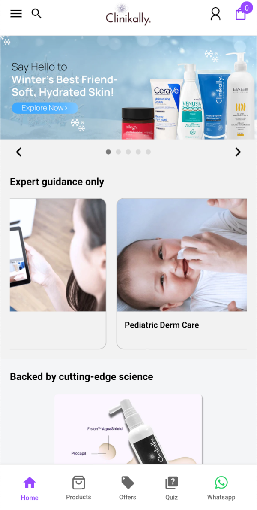
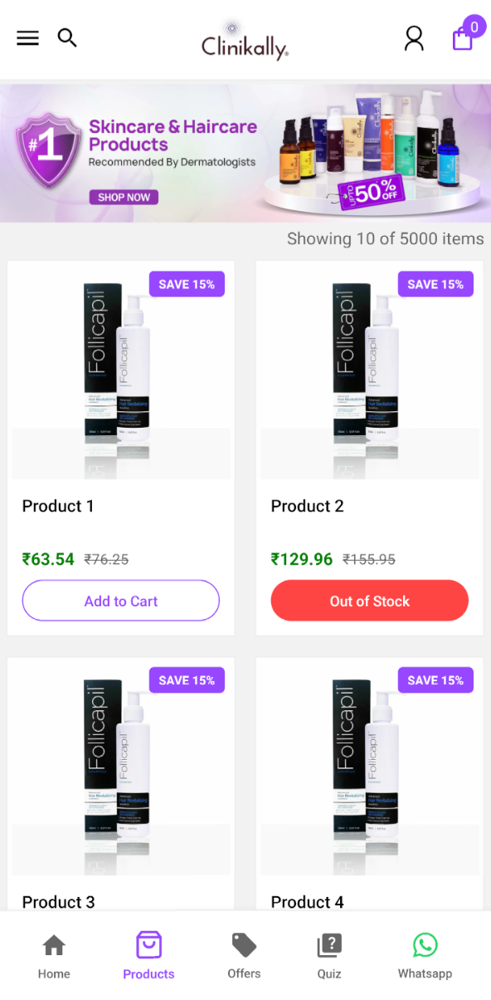
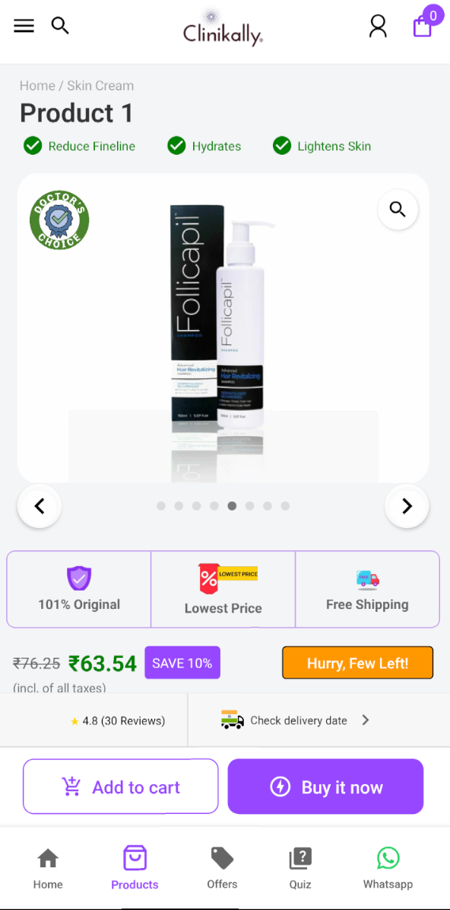
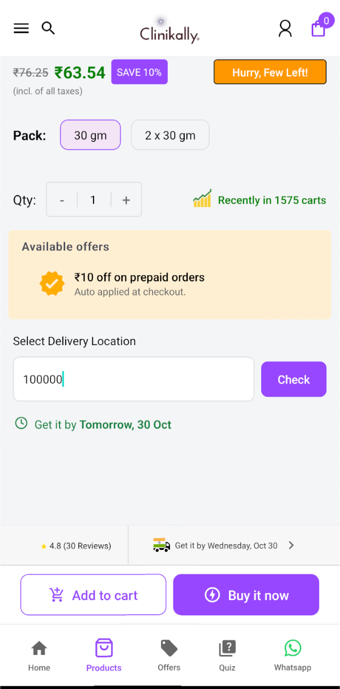

# Clinikally

<div align="center">


A next-generation healthcare delivery platform built with React Native

[](https://expo.dev)
[](LICENSE)
[](CONTRIBUTING.md)

</div>

Clinikally revolutionizes healthcare accessibility through its innovative React Native application. Experience seamless healthcare management with our intuitive interface and comprehensive feature set, designed to connect users with medical products and reliable delivery services.

## 🚀 Quick Start

```bash
# Clone the repository
git clone https://github.com/Avenster/clinikally-project.git

# Navigate to project directory
cd clinikally-project

# Fresh installation
rm -rf node_modules
rm package-lock.json
npm install

# Start the application
npm run ios     # For iOS
npm run android # For Android
```

## 🌟 Key Features

### 📦 Product Catalog
- **Extensive Selection**: Access to 5,000+ healthcare products
- **Real-time Availability**: 80% in-stock rate with live updates
- **Smart Search**: Find products quickly with intelligent search capabilities

### 🚚 Intelligent Delivery System
- **Multi-Provider Integration**: 
  - Provider A: Same-day delivery (Order before 5 PM)
  - Provider B: Same-day/next-day options
  - Partner Network: 2-5 day delivery nationwide
- **Smart Pincode Validation**: Automatic logistics provider matching
- **Live Countdown**: Real-time delivery cutoff indicators

### ⚡ Smart Features
- **Location Intelligence**: Pincode-based service customization
- **Delivery Estimates**: Accurate timing based on location type
- **Real-time Updates**: Live status tracking and notifications

### 💪 Technical Highlights
- **Responsive Design**: Seamless experience across all devices
- **Robust Error Handling**: Comprehensive user notifications
- **Clean Architecture**: Modular, maintainable codebase
- **Performance Optimized**: Fast loading and smooth interactions

## 📱 App Preview

| Screen | Description |
|--------|-------------|
|  | Home Screen with Featured Products |
|  | Product Catalog View |
|  | Detailed Product Information |
|  | Location Service Integration |

## 📲 Try It Out

Experience Clinikally directly through Expo:

<div align="center">

[](https://expo.dev/preview/update?message=second&updateRuntimeVersion=1.0.0&createdAt=2024-10-30T13%3A56%3A30.740Z&slug=exp&projectId=975ca44f-17d4-4092-ae5e-81c3dc2470ff&group=19d7df8c-dedc-475f-bc52-0a4fa6b7fd9a)

[Launch on Expo](https://expo.dev/preview/update?message=second&updateRuntimeVersion=1.0.0&createdAt=2024-10-30T13%3A56%3A30.740Z&slug=exp&projectId=975ca44f-17d4-4092-ae5e-81c3dc2470ff&group=19d7df8c-dedc-475f-bc52-0a4fa6b7fd9a)

</div>

## 📄 License

This project is licensed under the MIT License - see the [LICENSE](LICENSE) file for details.

## 🤝 Contributing

Contributions are welcome! Please feel free to submit a Pull Request.

## 📞 Support

For support, email support@clinikally.com or join our [Discord community](https://discord.gg/clinikally).

---

<div align="center">
Made with ❤️ by the Clinikally Team
</div>